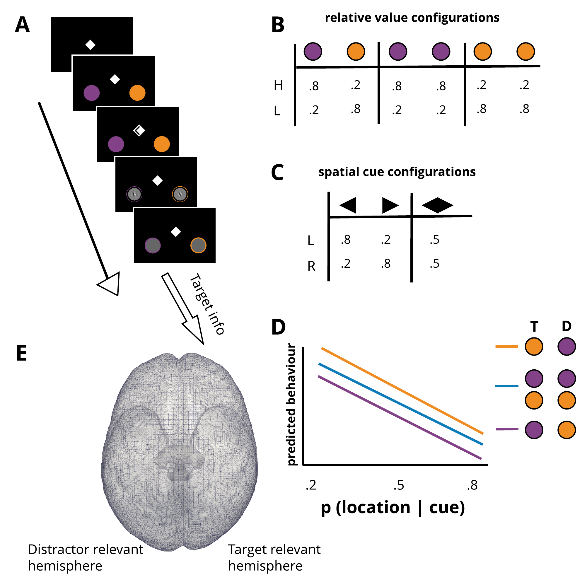
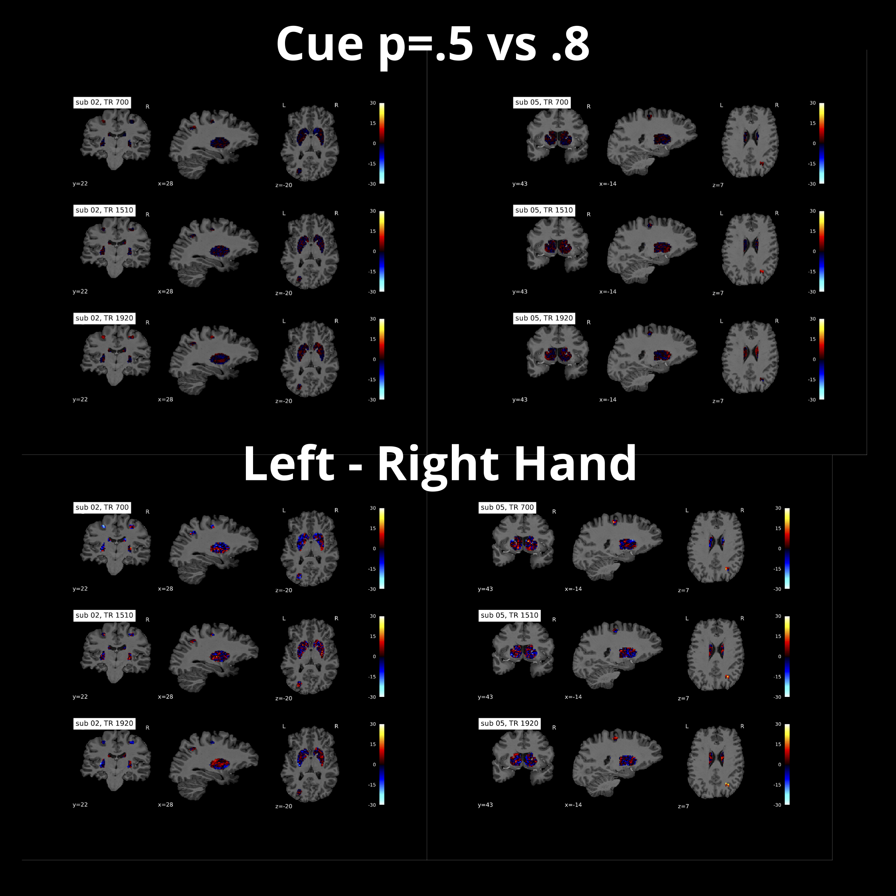

<br><br>

```{r, message=FALSE, warning=FALSE}
library(tidyverse)
library(rmarkdown)    # You need this library to run this template.
#library(epuRate)      # Install with devtools: install_github("holtzy/epuRate", force=TRUE)
library(knitr)
library(cowplot)
library(wesanderson)
```

# Overview and Aims

***

> We are seeking to image BOLD activity in the basal ganglia during performance of a visual cueing task. Imaging basal ganglia activity can be challenging owing to the higher iron content and small and variable location of the nuclei. We compared 7T sequences that were designed to provide high spatial precision with faster timing, without losing whole brain coverage. Importantly, we compared the contrast-to-noise ratio (CNR) of sequences under varying conditions assumed to influence spatial attention biases, as well as the more standard motoric comparison. We find that the sequence that provides the best CNR under varying spatial attention manipulations is not the same as that found for motoric comparisons. Optimisation of imaging parameters for the basal ganglia during experiments that assess cognitive manipulations can differ from optimal parameters for imaging motoric activity.

<br><br>

# Task

***

<br><br>

We designed a task that sought to assess the formation of visual spatial attention biases when probabilistic spatial and incentive value cues provide information about the upcoming target location. Participants (N=5) performed a target discrimination task (was the tilted gabor oriented clockwise or counter clockwise?). The upcoming location of the target was signalled using centrally presented spatial cues with a likelihood of p=.8 or p=.5. The incentive value of the two spatial locations (the points available should the target appear there) was signalled using coloured placeholders presented at each potential target location (see Fig 1). The code for running the task can be found [here](https://github.com/kel-github/imaging-cert-reward-att-task-code). A video of the task can be found [here](https://github.com/kel-github/imaging-cert-reward-att-task-code/tree/master/pilot_expCues) and the results of the analysis of the pilot data can be found [here](https://htmlpreview.github.io/?https://github.com/kel-github/imaging-cert-reward-att-task-code/blob/master/pilot_data_analysis/pilot_expCues/imag-cert-reward-att-pilot-analysis/imag-cert-reward-att-pilot-analysis.html).

Participants came to the scanner over 3 sessions (days), each occurring at the same time of day. Within each session participants completed 3 functional runs, one for each sequence. The task parameters were the same across each run. A T1 weighted image was also taken. All the data is available [here](https://cloud.rdm.uq.edu.au/index.php/apps/files/?dir=/STRIWP1HPC-Q1240&fileid=6157239623)

<br><br>

```{r, out.width="800px", fig.align='center', fig.cap="Paradigm: A) a single trial, B) colour cue/value pairings, C) Spatial cue/probabilities, D) Predicted behaviour, E) Target and distractor relevant hemisphere for that trial"}

```


<br><br>

# Sequences

***

<br><br>

We are seeking to determine which one of three possible sequences provides the best contrast to noise ratio (see [definition 2 of this paper](https://www-ncbi-nlm-nih-gov.ezproxy.library.uq.edu.au/pmc/articles/PMC3819355/)) for our comparisons of interest, in our regions of interest (see [here](https://www.dropbox.com/s/yiwxnd9bnzwgrwf/striavise-WP1-aims-hyps.html?dl=0) for details of ROIs and comparisons of interest). Full details of the protocols for the MRI sequences can be found [here](https://github.com/kel-github/code-4-seq-comp-test-7T/blob/master/ScanningProtocol_Kelly_19028.pdf). The key features are provided in the table below. The sequences will be referred to by their TR throughout this document.


```{r, echo=FALSE, results='asis'}
# Show it:
TRs <- data.frame(TR=c(700, 1510, 1920), 
                  TE=c('10/30.56','19.4','22'),
                  MultiBandAccel=c('4','3','x'),
                  VoxelSize=c(2,1.5,1.5))
kable(TRs, caption="Table 1. Compared sequences")
```


<br><br>

# Data processing

***

<br><br>

All preprocessing was performed using fmriprep v1.5.8. For an overview of the pre-processing steps, see [here](https://htmlpreview.github.io/?https://github.com/kel-github/code-4-seq-comp-test-7T/blob/master/preproc/sub-01.html). FMRIprep was used with the following command:

```
singularity run --cleanenv my_images/fmriprep-1.5.8.simg STRIWP1BIDS STRIWP1PROC participant --t2s-coreg --use-syn-sdc --fs-license-file freesurfer.txt --participant_label 01 02 03 04 05 --output-spaces T1w MNI152NLin2009cAsym fsaverage fsnative

```

The Singularity recipe for the environment in which post-processing was performed is available [here](https://github.com/kel-github/code-4-seq-comp-test-7T). Also see this link for the details of the software versions installed into this environment, and for bespoke modifications made to the singularity recipe.

First, multi-echo data from the TR 700 sequence were combined using a weighted summation (as detailed in [Equation 1](https://doi.org/10.1016/j.neuroimage.2017.12.005) of Puckett et al, 2018). [See here for the details of the workflow](https://github.com/kel-github/code-4-seq-comp-test-7T/blob/master/1_combine-echoes.ipynb). 

Subsequently, for each subject and sequence, [a first-level GLM](https://github.com/kel-github/code-4-seq-comp-test-7T/blob/master/2_SPM-GLM.ipynb) was fit to the [unsmoothed data](https://journals.plos.org/plosone/article?id=10.1371/journal.pone.0120572) (in participant T1w space), and the following contrasts estimated: 

+ main effect of target location (left vs right)
+ main effect of spatial cue probability (p=.5 vs .8)
+ the location x probability interaction 
+ absolute value (all low vs all high displays) 
+ relative value (high/low vs low/high displays)
+ the value interaction
+ hand of response (left vs right)

The [CNR images were calculated for each contrast](https://github.com/kel-github/code-4-seq-comp-test-7T/blob/master/3_beta-over-ResMS-images.ipynb) by taking the relevant contrast image, and dividing by the standard deviation of the residuals.

<br><br>

# Regions of Interest

***

<br><br>

We are interested in assessing the CNR observed in the ventral striatum, caudate nucleus, putamen, globus pallidus external (GPe), globus pallidus internal (GPi), and the sub-thalamic nucleus (STN), as well as the frontal eye fields (FEF), intraparietal sulcus (IPS) and the lateral occipital complex (LOC). To create masks of the basal ganglia ROIs in each participants T1 space, regions delineated in the 7T subcortical atlas provided by [Keuken et al, 2015](https://doi.org/10.1016/j.dib.2015.07.028) were first [joined bilaterally](https://github.com/kel-github/code-4-seq-comp-test-7T/blob/master/4_Combine-mask-files-Keuken-atlas.ipynb) (so that instead of left and right caudate images for example, there was one mask image containing left and right caudate). The same was performed for the cortical ROIs. Centroids of spherical cortical ROIs were defined using the peaks [observed in a meta-analysis conducted using neurosynth](https://www.dropbox.com/s/yiwxnd9bnzwgrwf/striavise-WP1-aims-hyps.html?dl=0). Spheres were defined around the peaks with [a radius of 5 mm](https://andysbrainbook.readthedocs.io/en/latest/fMRI_Short_Course/fMRI_09_ROIAnalysis.html#extracting-data-from-an-sphere). [See here for example images of the ROIs in participant T1w space](https://github.com/kel-github/code-4-seq-comp-test-7T/blob/master/ROI-mask-visualisation.ipynb).

All mask images were then [transformed into participant T1w space](https://github.com/kel-github/code-4-seq-comp-test-7T/blob/master/5_ROI-transforms.ipynb), and [resliced](https://github.com/kel-github/code-4-seq-comp-test-7T/blob/master/6_Reslice-and-mask-images.ipynb) to match the voxel sizes of each sequence. The CNR values for each contrast were then extracted for each ROI using each mask image. 

<br><br>

# CNR Images

***

<br><br>

Below you can see the CNR values over a subset of the ROIs, for 2 participants, for the main effect of target side, and the left vs right hand contrasts. Go [here](https://github.com/kel-github/code-4-seq-comp-test-7T/blob/master/plot-CNRs-for-2-subjects.ipynb) to see all the CNRs for the remaining contrasts for these subjects.

You may need to zoom/squint a little, but the general pattern is that for the main effect of cue, the CNR intensities get brighter when going from the TR700 sequence down to the TR1920 sequence. However, the reverse is true for left - right hand.

```{r, out.width="800px", fig.align='center', fig.cap="CNR values plotted for subjects 2 (left column) and 5 (right column). Figures show a random cross-section for each participant to give an idea of CNR values across ROIs"}

```

<br><br>

# Assessing CNR intensities across contrasts and sequences

***

<br><br>

Now we want to ascertain whether there are any differences in the CNRs observed, across brain regions and contrasts. Given that we are largely concerned with the magnitude rather than the direction of the CNR, I took the CNR values for all voxels within a given mask and [computed the RMS](https://github.com/kel-github/code-4-seq-comp-test-7T/blob/master/get_roi_cnr_data.m) per participant x ROI x contrast. 

```{r}

# Load and tidy data
CNR = read.csv('~/Dropbox/MC-Projects/imaging-value-cert-att/striwp1/TDFASTT-data/CNR_aggregated.csv')
CNR$sub <- factor(CNR$sub)
CNR$TR <- factor(CNR$TR)
CNR$roi <- factor(CNR$roi)
CNR$contrast <- factor(CNR$contrast)

CNR$roi <- CNR$roi %>% recode('1' = 'CN',
                              '2' = 'FEF',
                              '3' = 'GPe',
                              '4' = 'GPi',
                              '5' = 'IPS',
                              '6' = 'LOC',
                              '7' = 'Put', 
                              '8' = 'STN',
                               '9' = 'VS') 
CNR$contrast <- CNR$contrast %>%  recode('1' = 'tgtLoc',
                                         '2' = 'cueP',
                                         '3' = 'cueP x tgtLoc',
                                         '4' = 'AValue',
                                         '5' = 'RelValue',
                                         '6' = 'Value',
                                         '7' = 'hand')

CNR <- CNR %>% mutate(roi=factor(roi, levels = c('FEF', 'IPS', 'LOC', 'VS', 'CN', 'Put', 'GPe', 'GPi', 'STN')))

tail(CNR, 7)
```

For each contrast, I assess the influence of sequence (TR700, 1510, 1920) on CNRs separately for subcortical regions (VS, CN, Put, GPe, GPi, STN) and cortical regions ('FEF', 'IPS', 'LOC'). 

Note: upon plotting the data, I found that subject 1 was > 3 standard deviations from the mean for every ROI x contrast, so I have removed them from the subsequent analyses. However the pattern of results is the same whether I invlude them or not.

```{r}

CNR <- CNR %>% filter(sub != "1")
sprintf('excluding sub 1, remaining N = %d', length(unique(CNR$sub)))
```

<br><br>


# CNR comparsions 
***

<br><br>

First, I will plot the RMS CNR values to see if they follow the visual intuition implicated in the CNR figure above - that intensity increases from TR 700 to TR 1920 for the main effect of cue probability, and that this pattern reverses for the hand of response (L vs R) contrast.

<br><br>

```{r, out.width="800px", fig.align='center', fig.cap="Showing the RMS CNR values for each subject, TR sequence, and ROI for the main effect of response hand (LvsR)"}

draw.sub.plts <- function(data, C, titx){
  
  data %>% filter(contrast == C) %>%
           ggplot(aes(x=TR, y=R, group=sub)) +
           geom_line(aes(color=sub), lwd=1.1) + facet_wrap(.~roi) +
           scale_colour_manual(values=c(wes_palette("IsleofDogs1"))) +
           ylab("RMS CNR") +
           ggtitle(titx) +
           theme_cowplot()
}

draw.sub.plts(CNR, C="hand", titx="ME Response Hand")
```

<br><br>

```{r, out.width="800px", fig.align='center', fig.cap="Showing the RMS CNR values for each subject, TR sequence, and ROI for the main effect of cue probability (p=.5 vs .8)"}
draw.sub.plts(CNR, C="cueP", titx="ME Cue Prob")
```


A visual inspection of the data does support the inference made above. 

<br><br>

### The influence of TR on the RMS CNR Data taken from the Main Effect of Response Hand 

<br><br>

To test whether these differences were statistically significant for the ROIs in the basal ganglia, I applied a 3 (TR) x 6 (roi) repeated measures anova to the RMS CNR data from the response hand contrast. (Note: I do expect roi to differ, but have kept all rois in the model to determine whether I can detect a main effect of TR). Indeed, we find significant effects of TR, ROI and an ROI interaction.

```{r}

subcort <- CNR %>% filter(!roi %in% c('FEF', 'IPS', 'LOC'))
sub.mods <- lapply(levels(subcort$contrast), function(x) aov(R~TR*roi+Error(sub/(TR*roi)), data=subcort[subcort$contrast==x, ]))
summary(sub.mods[[7]])

```

And if we follow this up with paired-samples t-tests, we find that TR 700 is < TR 1920 (second result), and that TR 1510 < 1920 (last result). (All p's assessed against p=.05 with Sidak adjustment to .017).

```{r}
{x = c("700", "700", "1510")
y = c("1510", "1920", "1920")
do.ts <- function(data, x, y){
   t.test(data$R[data$TR == x], data$R[data$TR == y], paired=TRUE, var.equal=FALSE)
}
apply.ts <- function(data, sig){
  lapply(levels(data$contrast)[sig], function(c) mapply(do.ts, x, y, MoreArgs=list(data=data[data$contrast == c, ])))
}
sig = c(1, 2, 3, 4, 5, 6, 7)
fucomps <- apply.ts(data=subcort, sig=sig)}
fucomps[[7]]

```

<br><br>

### The influence of TR on the RMS CNR Data taken from the Main Effect of Cue Probability 

<br><br>

This time, we observe an almost opposite pattern of results.

```{r}
summary(sub.mods[[1]])
```


Follow up tests show that: TR 700 < 1510, TR 700 < TR 1920
```{r}
fucomps[[1]]
```

<br><br>

# Consistency of result

***

<br><br>

Indeed, 4 out of the 5 remaining contrasts showed the same result as the cue probability contrast, which is in opposition to what was observed for the response hand contrast. The plots and analyses are presented at the bottom of this document below.

Note: none of the models applied to the cortical ROIs showed any statistically significant results.

<br><br>

# Conclusions

***

<br><br>

For our purposes of imaging BOLD responses in subcortical brain regions while spatial and value cues influence performance on a visual discrimination task, the TR 1510 and 1920 sequences provide the best contrast-to-noise-ratio. However, given inspection of the figures and analyses listed below, there is evidence that the TR 1920 outperforms the TR 1510 sequence under some circumstances. Therefore we will use the TR 1920 sequence.

Interestingly, this is almost the opposite conclusion that would have been made had we used the response hand (motoric) contrast, as is more common in the literature (e.g. [Pucket et al, 2018](https://www-sciencedirect-com.ezproxy.library.uq.edu.au/science/article/pii/S1053811917310194?via%3Dihub), [Miletic et al, 2020](https://www-sciencedirect-com.ezproxy.library.uq.edu.au/science/article/pii/S105381192030478X?via%3Dihub), [Hollander, et al, 2017](https://pubmed-ncbi-nlm-nih-gov.ezproxy.library.uq.edu.au/28345164/)).

Although there was an influence of sequence observed for subcortical regions, we did not observe an influence on CNR in our cortical ROIs.

<br><br>

# Appendices

***

<br><br>

> Main effect of Target Location

```{r, out.width="800px", fig.align='center', fig.cap="Showing the RMS CNR values for each subject, TR sequence, and ROI for the main effect of Target Location (LvsR)"}

draw.sub.plts(CNR, C="tgtLoc", titx="ME Target Location (L vs R")
```
```{r}
summary(sub.mods[[2]])
```
```{r}
fucomps[[2]]
```

<br><br>

> Target Location x Cue Probability Interaction

```{r, out.width="800px", fig.align='center', fig.cap="Showing the RMS CNR values for each subject, TR sequence, and ROI for the Target Location x Cue Probability Interaction"}

draw.sub.plts(CNR, C="cueP x tgtLoc", titx="Target Loc x Cue Prob")
```

```{r}
summary(sub.mods[[3]])
```
```{r}
fucomps[[3]]
```

<br><br>

> Absolute Value Comparison

```{r, out.width="800px", fig.align='center', fig.cap="Showing the RMS CNR values for each subject, TR sequence, and ROI for the effect of Display Value"}

draw.sub.plts(CNR, C="AValue", titx="Display Value (H v L")
```
```{r}
summary(sub.mods[[4]])
```
```{r}
fucomps[[4]]
```

<br><br>

> Relative Value Comparison

```{r, out.width="800px", fig.align='center', fig.cap="Showing the RMS CNR values for each subject, TR sequence, and ROI for the effect of Relative Value (H/L) vs (L/H)"}

draw.sub.plts(CNR, C="RelValue", titx="Relative Value (H v L")
```

```{r}
summary(sub.mods[[6]])
```
```{r}
fucomps[[6]]
```